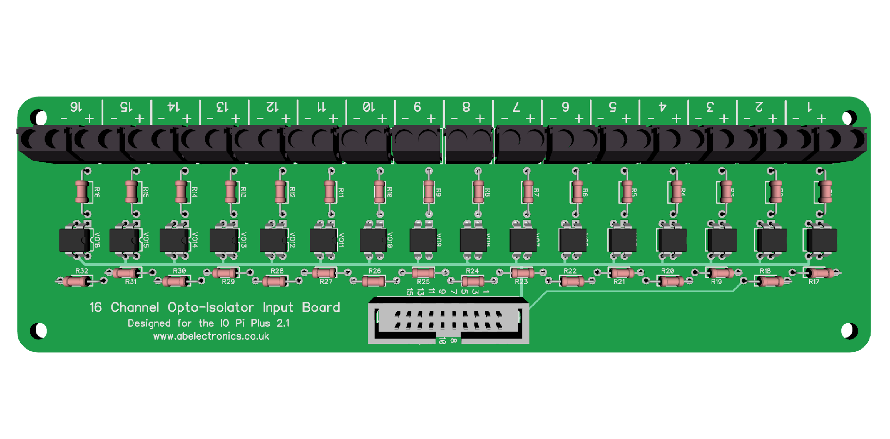

# 16 Channel Opto-Isolated Input Board for the IO Pi Plus 2.1

This is a 16 channel opto-isolated input board suitable for use with the [IO Pi Plus version 2.1 from AB Electronics UK](https://www.abelectronics.co.uk/p/54/IO-Pi-Plus).  The board is designed to work with the FOD817C300 opto-isolator from Fairchild Semiconductor but it should work with any 4 pin transistor opto-isolator that uses the same pin configuration.

To build the relay board you will need the following parts:

- VO1 to VO16: 16 x FOD817C300 opto-isolator
- R1 to R16 - 0.25W Resistor (see below for calculating values)
- R17 to R32 - 1K 0.25W Resistor
- 1 x 20 pin IDC PCB connector (2.54mm pitch)  
- 16 x 2 pin 5.08mm screw terminals or other compatible connector. (5.00mm will also work)
  
## IDC Connector  

The 20 pin IDC connector uses the same pin configuration as the [IO Pi Plus 2.1](https://www.abelectronics.co.uk/p/54/IO-Pi-Plus) so you can connect the two together using two 20 pin IDC connectors and a ribbon cable.  The input numbers match the pin numbering on the IO Pi Plus bus making it easy to read the inputs using our IO Pi software libraries.

## Input Resistors  

The input resistors R1 to R16 will need to be specified for the input voltage.  The emitter for the FOD817C300 opto-isolator requires a maximum current of 20mA at 1.2V.  Our [LED resistor calculator](https://www.abelectronics.co.uk/tools/resistor-led-calc) can be used to find the required resistance.  For example a 560R resistor will give a usable input voltage range of 3V to 12V.  

## PCB Files  

The PCB dimensions are **60mm x 200mm**.  Gerber files are included in the project folder and use a file name format compatible with several PCB manufacturers including [iTead](https://www.itead.cc/open-pcb/pcb-prototyping/2layer-pcb-larger-than-10cm-x-10cm.html) and [Elecrow](https://www.elecrow.com/services/pcb-prototyping/5pcs-2-layer-pcb.html).  The “Gerber Files.zip” file contains a zip of the gerber files that can be uploaded directly to the PCB manufacturer of your choice.
The schematic and PCB files are included in Diptrace format, you can download a free version of Diptrace from [http://diptrace.com/download-diptrace/](http://diptrace.com/download-diptrace/)

----------

**Note:** The input board can be used with older versions of the IO Pi Plus and IO Pi Zero as well as the original IO Pi but you will need to only connect the 16 input pins on the IDC connector.  The ground pin will need to be connected separately to the GND pin on the IO Pi board as earlier models did not include the ground on the IDC header.  The input numbers will also not match up to the inputs on the IO Pi.
